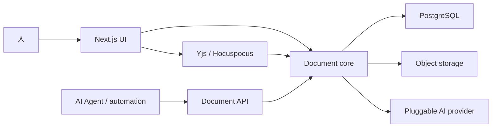

# doc

> **面向人与 AI Agent 的可迁移协作文档平面。**
>
> 自托管 · 实时协作 · 可恢复版本 · AI 辅助 · 文档归用户所有

[](https://github.com/fullstack-ai-infra/doc/actions/workflows/ci.yml)
[](#project-status)

**A portable, self-hosted document plane for people and AI agents.**

`doc` 把富文本编辑、目录管理、多人实时协作、文档发布、版本恢复和 AI 辅助放在
同一套文档与权限内核上。它首先服务于人类可见、可审阅的写作体验，同时为 Agent
保留稳定的 API 与可追溯修改边界。

项目的北极星、边界与验收场景见 [GOAL.md](GOAL.md)，当前实现契约见
[SPEC.md](SPEC.md)。

> [!WARNING]
> `doc` 仍处于 experimental 阶段。接口、数据模型和部署方式可能变化，请勿把它
> 作为重要文档的唯一副本。

## What is in this repository?

| Component                 | Purpose                                    |
| ------------------------- | ------------------------------------------ |
| `src/`                    | Next.js 产品界面、HTTP API、认证与文档能力 |
| `services/collaboration/` | Hocuspocus/Yjs 实时协作服务                |
| `packages/cli/`           | `doc` 远程文档与本地运维 CLI               |
| `prisma/`                 | PostgreSQL 文档、权限、发布和版本数据模型  |
| `docker-compose.yml`      | PostgreSQL、迁移、协作与 Web 完整服务栈    |
| `docs/`                   | 开发、运行与架构说明                       |

## 当前能力

- 树形文档目录、拖拽排序、搜索、收藏、回收站和模板
- Tiptap 富文本编辑器、表格、图片、任务列表、Mermaid 与 PDF 导出
- Yjs/Hocuspocus 多人实时协作、离线缓存与分享权限
- 公开发布、共享关系与后台内容治理
- 文档版本快照、差异查看和恢复
- AI 续写、总结、大纲、翻译、改写和文档侧边对话
- 中英文界面、暗色/亮色主题和 GitHub/邮箱认证
- scoped PAT 与 `/api/v1`：文档列表、读取、新建和 ETag 保护的元数据更新
- `doc` CLI：远程文档命令，以及本地初始化、诊断、服务栈启停、状态、日志和数据库任务

完整的已交付、实验性与暂缺能力见 [docs/CAPABILITIES.md](docs/CAPABILITIES.md)。

## 架构



UI、API 与协作服务必须共享同一套文档、权限和版本语义。AI 生成内容不会绕过用户
审阅直接成为不可见状态；版本恢复会先保护当前快照。

## 与 `mem` 的边界

| 项目                                               | 核心对象                          | 主要职责                              |
| -------------------------------------------------- | --------------------------------- | ------------------------------------- |
| [`mem`](https://github.com/fullstack-ai-infra/mem) | 文件、记忆、实体、任务 checkpoint | 跨 Agent 的可迁移上下文与原始资产     |
| `doc`                                              | 可编辑文档、目录、版本与协作状态  | 人与 Agent 共同写作、审阅、发布和恢复 |

`doc` 不是通用 Agent runtime，也不替代 `mem` 的多模态原件与长期记忆。两者未来可
通过稳定 API 连接，但各自保持独立的数据所有权和部署边界。

## 快速开始

需要 Node.js 24、npm、Docker 和 Docker Compose。

```bash
npm ci
npm install --global ./packages/cli
doc init
doc doctor
doc up --build
doc doctor --live
```

打开 <http://localhost:3000>。登录后可在用户设置创建 scoped PAT，再通过 `doc auth login`
连接。CLI 契约见 [docs/CLI.md](docs/CLI.md)，API 契约见 [docs/API.md](docs/API.md)，完整配置
和分服务启动方式见 [docs/RUN_LOCAL.md](docs/RUN_LOCAL.md)。

## 开发

```bash
npm run dev                  # Next.js
npm run dev:collaboration    # collaboration service
npm run doc -- --help        # repository-local CLI
npm run test-ci              # unit tests
npm run check                # format, lint, tests, service syntax and build
```

贡献边界见 [docs/DEVELOPMENT.md](docs/DEVELOPMENT.md)。版本变化记录在
[CHANGELOG.md](CHANGELOG.md)。

## Project status

当前定位是可开发、可自托管的产品基础，而不是稳定发布版。接下来的重点是：

1. 增加 active-room-aware 的正文 mutation gateway，并扩展版本、发布和 bundle API。
2. 增加可重复的多客户端协作、主动撤权和版本恢复回归测试。
3. 完善对象存储抽象和生产 migration 工作流。
4. 补齐审计事件、速率限制、指标和结构化日志。

安全问题请按 [SECURITY.md](SECURITY.md) 私下报告。
